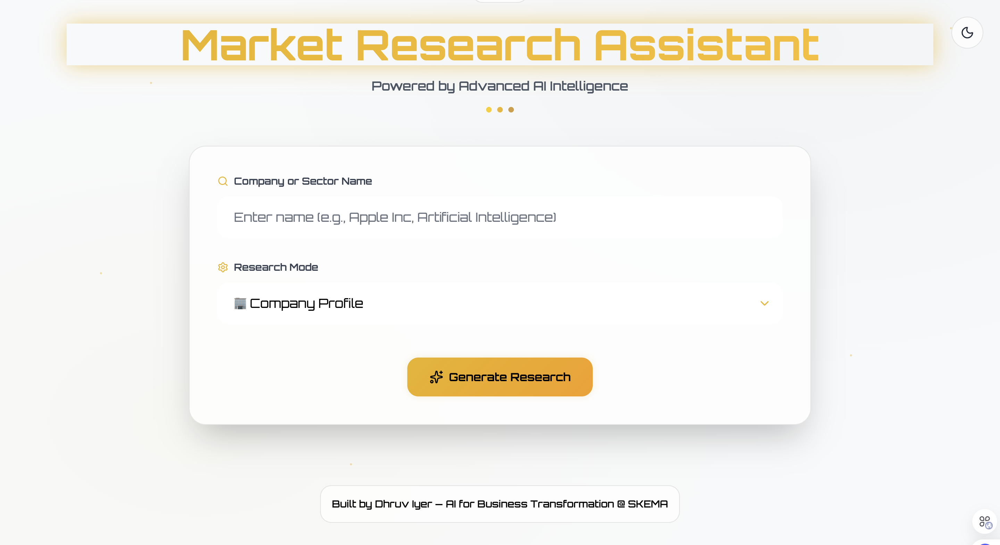

# Market Research Agent

A Node.js application that provides market research information for companies and industry sectors using OpenRouter with DeepSeek R1 0528 Qwen3 8B

Consultant-grade market and company research assistant that blends AI with structured analysis to produce executive-ready deliverables. Built for strategy, corp dev, product, and investor workflows at the intersection of AI and business transformation.

---

## Live Demo

- https://ai-market-research-assistant.onrender.com

---

## Screenshot



---

## Why this exists

- Deliver expert, decision-oriented analysis in minutes, not days.
- Bring consistency with opinionated, high-quality prompts and formatting.
- Bridge business framing with technical depth (AI architecture, economics, compliance).

---

## What it produces

- Company profiles with KPIs, risks, and strategic priorities
- Actionable SWOT briefs with recommendations
- Sector/industry trend analyses with scenarios and KPI frameworks
- AI impact assessments for companies and sectors (economics, stack, compliance)
- Exportable reports (HTML-styled, text; PDF fallback via Puppeteer)

---

## Architecture overview

- `server.js` – Express server exposing a web UI and REST endpoints
- `routes/research.js` – Single research endpoint accepting `mode` to switch analysis type
- `routes/export.js` – Export endpoint (text by default, PDF via headless Chromium)
- `prompts/` – Consultant-grade prompt generators:
  - `profilePrompt.js` → `getProfilePrompt(companyName)`
  - `swotPrompt.js` → `companyPrompt(companyName)`, `sectorPrompt(sectorName)`
  - `aiImpactPrompt.js` → `getCompanyAIImpactPrompt(companyName)`, `getSectorAIImpactPrompt(sectorName)`
- `services/openrouterService.js` – OpenRouter client (Chat Completions API)
- `services/formatOutput.js` – Markdown/HTML formatters with TOC and styling
- `public/` – Minimal web UI (submit queries, view results, export)

Project structure

```
market-research-agent/
├── server.js
├── routes/
│   ├── research.js
│   └── export.js
├── prompts/
│   ├── profilePrompt.js
│   ├── swotPrompt.js
│   └── aiImpactPrompt.js
├── services/
│   ├── openrouterService.js
│   └── formatOutput.js
├── public/
│   ├── index.html
│   ├── script.js
│   └── styles.css (if present)
├── .env
├── package.json
└── README.md
```

---

## Running locally

1) Install dependencies

```bash
npm install
```

2) Configure environment variables in `.env`

```bash
OPENROUTER_API_KEY=your_openrouter_api_key_here
OPENROUTER_MODEL=deepseek/deepseek-r1-0528-qwen3-8b:free
PORT=3000
HTTP_REFERER=https://your-app-domain.com
X_TITLE=Market Research Agent
```

3) Start the server

```bash
npm start
```

4) Open the app

- UI: http://localhost:3000
- API: http://localhost:3000/api

---

## API

Single endpoint with modes.

- Endpoint: `POST /api/research`
- Body params:
  - `query` string – the company or sector to analyze
  - `mode` enum – `profile` | `swot` | `trends` | `aiImpact`
  - `entityType` optional enum – `sector` for sector-level AI impact only

Examples

- Company profile
```bash
curl -s -X POST http://localhost:3000/api/research \
  -H "Content-Type: application/json" \
  -d '{"query":"NVIDIA","mode":"profile"}' | jq -r .formatted_analysis > nvidia.html
```

- Company SWOT
```bash
curl -s -X POST http://localhost:3000/api/research \
  -H "Content-Type: application/json" \
  -d '{"query":"NVIDIA","mode":"swot"}'
```

- Sector trends
```bash
curl -s -X POST http://localhost:3000/api/research \
  -H "Content-Type: application/json" \
  -d '{"query":"Semiconductors","mode":"trends"}'
```

- AI impact (company)
```bash
curl -s -X POST http://localhost:3000/api/research \
  -H "Content-Type: application/json" \
  -d '{"query":"NVIDIA","mode":"aiImpact"}'
```

- AI impact (sector)
```bash
curl -s -X POST http://localhost:3000/api/research \
  -H "Content-Type: application/json" \
  -d '{"query":"Semiconductors","mode":"aiImpact","entityType":"sector"}'
```

Response shape

```json
{
  "query": "NVIDIA",
  "mode": "profile",
  "entityType": "company",
  "analysis": "Raw model response (plain text)",
  "formatted_analysis": "Full HTML with headings, lists, and optional TOC",
  "basic_formatted": "Simplified HTML formatter output",
  "full_response": { }
}
```

---

## Model configuration

- Default model used in code: `deepseek/deepseek-r1-0528-qwen3-8b:free`.
- You can override it via `.env`:

```bash
OPENROUTER_MODEL=deepseek/deepseek-r1-0528-qwen3-8b:free
```

Notes

- Some free models require specific OpenRouter privacy settings. If you see a 404 related to data policy or ZDR (Zero Data Retention), review your settings at https://openrouter.ai/settings/privacy or select a model compatible with your preferences.

---

## Prompting approach (consultant-grade)

Prompts are designed to elicit decision-ready outputs:

- ALL-CAPS numbered sections for consistent formatting and TOC generation
- Quantification guidance and explicit handling of unknowns
- Emphasis on economics, GTM, risks, compliance, and KPIs
- Separate company vs. sector framing and dedicated AI impact lenses

Files of interest

- `prompts/profilePrompt.js` – Expert company profile with KPIs and priorities
- `prompts/swotPrompt.js` – Decision-oriented SWOT and sector trends
- `prompts/aiImpactPrompt.js` – AI economics, stack, compliance, and roadmap

---

## Exports

You can export analysis via the UI or programmatically.

- Endpoint: `POST /api/export`
- Body params:
  - `filename` string – desired file name (extension added automatically)
  - `content` string – the raw or HTML content to export
  - `format` enum – `txt` (default) or `pdf`
  - `htmlContent` optional string – custom HTML wrapper for PDF

Notes

- PDF uses headless Chromium via `puppeteer`. If PDF generation fails, the service falls back to text export.

## License

ISC